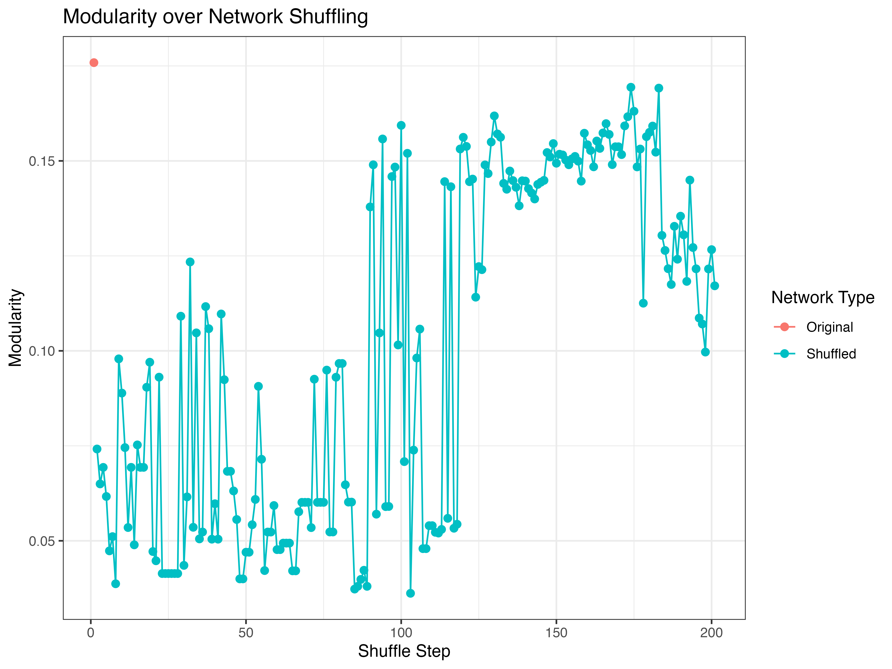

This post introduces how to calculate and assess modularity in food web networks using the `multiweb` R package. We illustrate this with the Potter Cove food web (included in the package as `netData[[23]]`) and show how to run Infomap, compare implementations, and apply network randomization routines.
You need to install infomap 

[Infomap Installation](https://www.mapequation.org/infomap/#Install)

and 'multiweb' 

```r
require(devtools)
install_github("lsaravia/multiweb")
```

---

## Run Infomap on an Empirical Food Web

We use the `run_infomap()` function, an interface between R and the external Infomap binary:

```r
library(multiweb)
library(tidyverse)

g <- netData[[23]] # Potter Cove food web

py_infomap0 <- run_infomap(g, output_dir = ".", return_df = TRUE)
py_infomap0$codelength
```

```text
[1] 4.36376
```

To explore the module membership:

```r
py_infomap0 <- py_infomap0$communities
py_infomap0 %>% filter(module == 1)
```

Output for module 1:
```text
  module                       node      flow
1      1 Gobionotothen gibberifrons 0.0162264
2      1          Notothenia rossii 0.0593102
3      1     Harpagifer antarcticus 0.0411967
4      1  Lindbergichthys nudifrons 0.0255800
5      1    Chaenocephalus aceratus 0.1391530
6      1  Parachaenichthys charcoti 0.0024676
```

Alternatively, retrieve an igraph-compatible object:

```r
py_infomap <- run_infomap(g)
py_infomap$codelength
```

```text
IGRAPH clustering infomap, groups: 7, mod: 0.18
+ groups:
  $`1`
  [1] "Gobionotothen gibberifrons" "Notothenia rossii"          "Harpagifer antarcticus"     "Lindbergichthys nudifrons" 
  [5] "Chaenocephalus aceratus"    "Parachaenichthys charcoti" 


$codelength
[1] 4.36376
```


### ❗ A Note on `cluster_infomap`

The same algorithm is included in `igraph` as `cluster_infomap()`, but it produces different results:

```r
ig_infomap <- cluster_infomap(g)
ig_infomap$codelength
```

```text
IGRAPH clustering infomap, groups: 1, mod: 0
+ groups:
  $`1`
    [1] "Aged detritus"                "Polychaeta"                   "Polynoidae"                   "Gitanopsis squamosa"         
    [5] "Gobionotothen gibberifrons"   "Notothenia rossii"            "Ophionotus victoriae"         "Aequiyoldia eightsii"        
    [9] "Salpidae"                     "Gammaridea"                   "Ostracoda"                    "Oligochaeta"                 
  + ... omitted several groups/vertices


[1] 5.845473
```

We validated our results against the Infomap web interface and found that `run_infomap()` yields consistent and accurate results. We therefore recommend **not using** `cluster_infomap()` for empirical studies.

---

## Randomizing Networks for Null Model Comparison

### 1. Curveball Randomization

We can randomize networks using the **curveball algorithm**, which preserves row/column sums (degree sequence):

```r
gl <- curve_ball(g)
modl <- calc_modularity(gl, cluster_function = run_infomap)
```

Plotting the distribution of modularity across replicates:

```r
ggplot(modl, aes(x = Modularity)) +
  geom_density(fill = "skyblue", alpha = 0.5) +
  geom_vline(xintercept = py_infomap$modularity, color = "red", linetype = "dashed") +
  labs(title = "Distribution of Modularity under Curveball Randomization",
       x = "Modularity", y = "Density") + theme_bw()
```



---

### 2. Degree-Preserving Shuffling

This routine preserves the in- and out-degree sequence via iterative edge swaps:

```r
shuffle_network_deg(input_graph, delta = 10)
```
Where `delta` is the number of swaps 

We use this in a more systematic way with:

```r
results <– generate_shuffled_seq(
  netData[[29]], 
  max_delta= 200,
  modularity_func = run_infomap, 
  shuffle_func = shuffle_network_deg
)

```

This produces a sequence of 200 networks each with 10 edge swaps using the `shuffle_network_deg` algorithm 

Plotting modularity over shuffle steps can help detect when modularity deviates from the empirical structure.

```r
# Extract modularity metrics
metrics_df <- result$Metrics

# Add a column identifying the original vs shuffled
metrics_df$Type <- ifelse(metrics_df$Step == 1, "Original", "Shuffled")

# Plot modularity over shuffle steps
ggplot(metrics_df, aes(x = Step, y = Modularity, color = Type)) +
  geom_line() +
  geom_point(size = 2) +
  labs(title = "Modularity over Network Shuffling",
       x = "Shuffle Step",
       y = "Modularity",
       color = "Network Type") +
  theme_bw()
````



---

The graph shows that gradual shuffling runs through the distribution of modularity values ​​obtained by the `curve_ball` routine (previous graph) and at least in 200 iterations no stabilization of modularity is observed.

## Summary

- `run_infomap()` wraps the external Infomap binary and gives reliable modularity estimates.
- `cluster_infomap()` (igraph) gives different results than the original app.
- Randomization routines like `curve_ball()` and `shuffle_network_deg()` help assess structural significance.
- `shuffle_network_deg()` is useful for increasingly randomize the network in steps but it is slower for a complete
   randomization.
- `curve_ball()` randomize the network in an efficient and unbiased way
- Visualizing modularity distributions is key for interpreting modular structure.

---

## Resources

- 📦 [multiweb GitHub Repository](https://github.com/lsaravia/multiweb)
- 📘 [Infomap Installation](https://www.mapequation.org/infomap/#Install)
- 📄 Strona et al. 2014. *Nature Communications* 5:4114. [https://doi.org/10.1038/ncomms5114](https://doi.org/10.1038/ncomms5114)

Feel free to reach out or open an issue on GitHub if you'd like to contribute!

